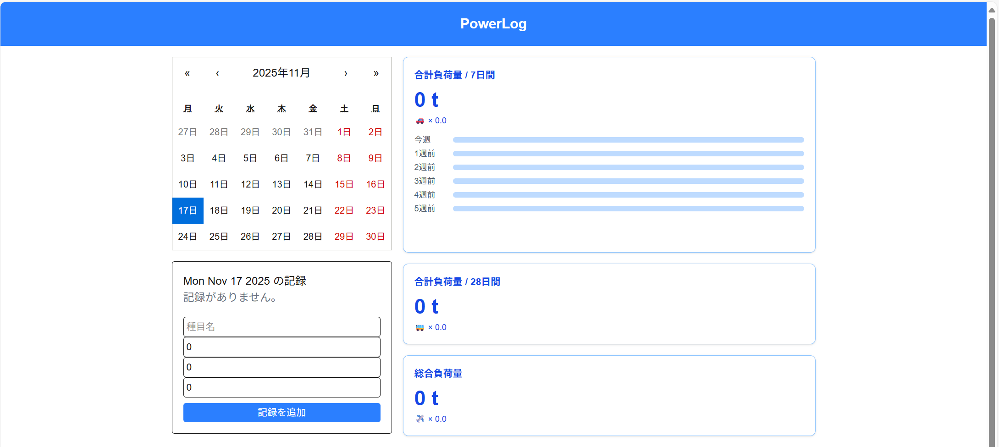

# Okamoto510
## 🛠 使用技術・ツール（Tech Stack）

| 分野             | 技術・ツール例                                         |
|------------------|--------------------------------------------------------|
| 言語 / フレームワーク | TypeScript / JavaScript / HTML / CSS / Next.js / React |
| スタイリング      | Tailwind CSS / SCSS                                  |
| バージョン管理    | Git / GitHub                                          |
| 開発ツール        | VSCode |
## 🛠️ 使用技術・ツール（Tech Stack）

  

# 🏋️‍♂️ Training App（筋トレ記録アプリ）

[👉 アプリを見る](https://github.com/tanida3/training-app)

---

## 📌 概要

このアプリは、日々のトレーニングを記録・管理できる**筋トレ記録アプリ**です。  
カレンダー形式でログを振り返りながら、目標設定やトレーニング内容を記録できます。

**友人と共同で設計・開発**を行いました。

---

## 🚀 使用技術

- **Next.js**（App Router）
- **React**
- **TypeScript**
- **Tailwind CSS**

---

## 🔧 主な機能

- カレンダーから日付を選択し、トレーニング内容を記録
- 種目・回数・セット数・重量などの詳細入力
- トレーニング目標の設定／削除
- 登録済みの目標・記録の一覧表示
- スマートフォン対応（レスポンシブ対応済み）

---

## 📱 スクリーンショット

---

## 👨‍💻 制作背景

フロントエンド技術の習得と、**実用的なUI/UX設計の実践**を目的に開発しました。  
実際のユーザー体験を想定しながら、設計から実装まで協力して進めました。

---

## 🛠 今後の追加予定機能

- 各画面に戻るボタンの表示
- 会員登録機能の追加
- グラフによるトレーニング推移の可視化

---

## 👥 開発メンバー

- [岡本 耀](mailto:hikaru.012723@gmail.com)
- tanida3（GitHub）

---

## 🔗 リンク

- 📂 GitHubリポジトリ: [https://github.com/tanida3/training-app](https://github.com/tanida3/training-app)
